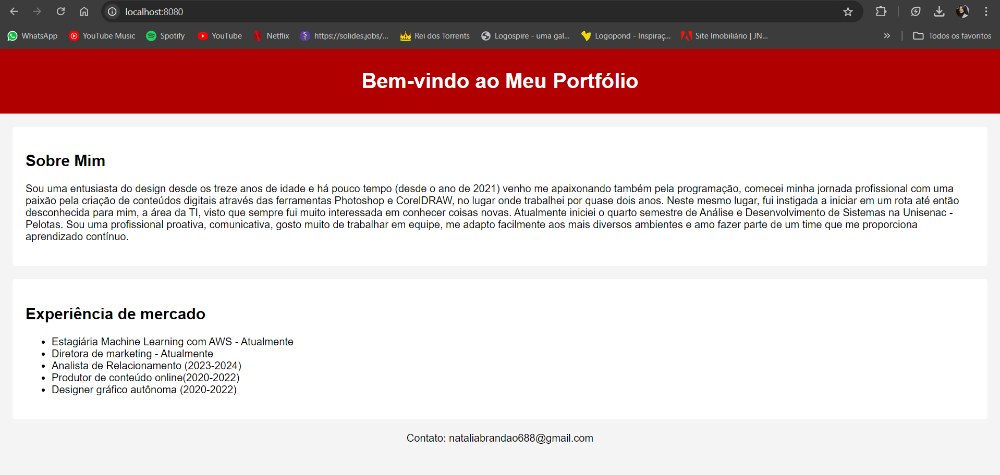

# Criação de portfólio com flask
Este projeto tem como objetivo desenvolver uma aplicação web para visualizar o meu portfólio.
***

## Tecnologias Utilizadas
* HTML
* CSS
* Python
* Docker
* Flask

## Como o Sistema Foi Desenvolvido
***
**Criação do portfolio**
- Página HTML (Estilizada com CSS puro). 
- Após isso criei o arquivo python importando o flask, onde criei uma rota "/" para expor estes dados renderizando a página HTML

**Dockerfile:**
- Defini a imagem base do contêiner
FROM python:3.9-slim 

- Defini o diretório de trabalho
WORKDIR /app

- Copiei todos os arquivos e pastas do diretório atual para o diretório de trabalho no contêiner
COPY . .

-Executei o comando pip install para instalar todas as bibliotecas listadas no arquivo requirements.txt
RUN pip install --no-cache-dir -r requirements.txt

Informei ao Docker a porta 8080
EXPOSE 8080

Defini o comando que será executado quando o contêiner for iniciado
CMD ["python", "main.py"]

**Execução do conteiner**
- Executei atráves dos comandos: 
1. docker build -t flask-app .

2. docker run -d -p 8080:8080 flask-app

***

**Prova do funcionamento:**
